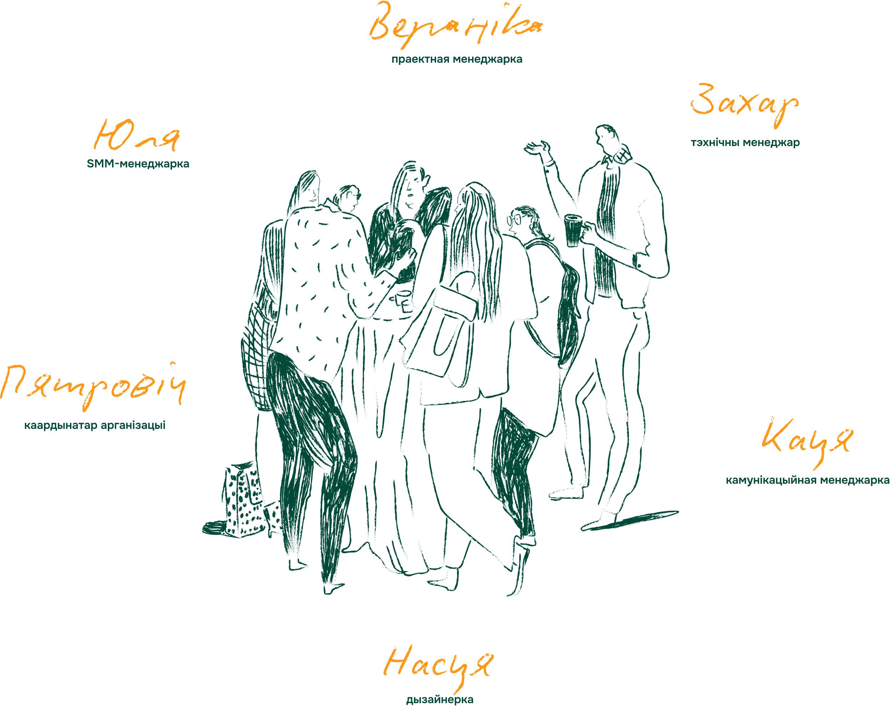

## Хто мы

«Тэрыторыя правоў» – гэта надзейны пункт старту для ўсіх, хто хоча разумець і ведаць як абараняць свае правы. Мы верым, што веданне і разуменне правоў чалавека з’яўляюцца важнымі для пабудовы справядлівага і роўнапраўнага грамадства.

  
Місія

  Фармаванне і прасоўванне культуры правоў чалавека ў беларускім грамадстве, праз адукацыю і асвету, дзе кожн_ая ведае свае правы і падзяляе каштоўнасці чалавечай годнасці

  
Мэта

  Стварыць актыўную супольнасць, дзе кожн_ая падзяляе каштоўнасці чалавечай годнасці, ведае свае правы і гатовы абараняць іх

  
Чым мы займаемся?

  - Тлумачым правы чалавека простай мовай праз зразумелыя прыклады;
  - Падтрымліваем беларускую мову і культуру;
  - Арганізуем адукацыйныя праграмы, курсы і семінары;
  - Падтрымліваем актывіста_к, валанцёра_к і пачынаючых праваабаронцаў;
  - Распрацоўваем матэрыялы і ініцыятывы па папулярызацыі прававой культуры.

## Каманда

Мы – група людзей з розным досведам, але адной мэтай: зрабіць правы чалавека бліжэйшымі і зразумелымі для ўсіх

